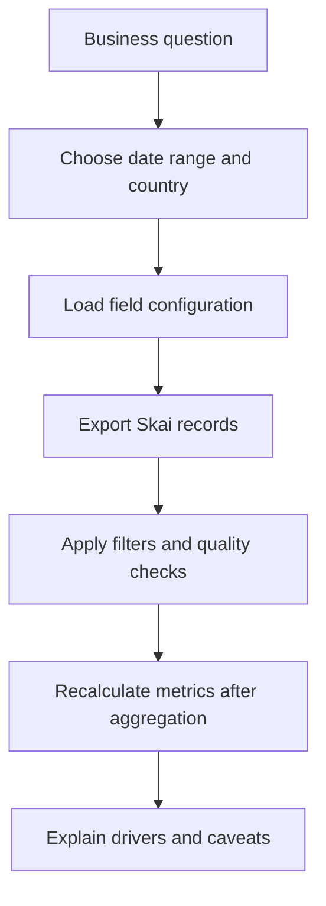

# Skai Performance Analyst Skill


An AI-assisted performance reporting workflow for Skai data. It exports campaign, ad, creative, and media metrics into analyst-ready files, then guides reproducible business analysis such as drivers, outliers, period comparisons, and quality checks.

## Why It Matters

Paid media teams need fast answers without losing analytical rigor. This skill operationalizes the path from platform API data to business-ready analysis: consistent field config, repeatable exports, metric recalculation rules, and outputs that can be inspected or reused.

| Business value | Technical value |
| --- | --- |
| Faster paid media diagnostics | Configurable Skai API export script |
| Better explanation of performance shifts | Period comparison and driver-analysis workflow |
| More reliable metric interpretation | Explicit rules for CTR, conversions, aggregation, and sample size |
| Cleaner analyst handoff | CSV/JSON records plus run summary |

## What It Can Do

- Export Skai performance data by date range and country.
- Use configurable dimensions and metrics for account-specific schemas.
- Generate current and prior-period datasets for comparison.
- Filter video creatives or excluded brand groups when required.
- Identify top ads, campaigns, sources, brands, and outliers.
- Produce structured data quality checks for missing fields or suspicious records.

## Analysis Flow



## Repository Structure

```text
.
|-- SKILL.md
|-- agents/openai.yaml
|-- references/
|   |-- analysis-playbook.md
|   |-- configuration.md
|   `-- default-field-config.json
`-- scripts/skai_report_export.py
```

## Example Commands

```bash
python3 scripts/skai_report_export.py \
  --start-date 2026-04-01 \
  --end-date 2026-04-30 \
  --country ES \
  --output-dir /tmp/skai-current

python3 scripts/skai_report_export.py \
  --start-date 2026-03-01 \
  --end-date 2026-03-31 \
  --country ES \
  --output-dir /tmp/skai-prior
```

## Question Types

| Question | Example output |
| --- | --- |
| What drove a CTR drop? | Campaign, brand, source, and creative-level contribution |
| Which ads are outliers? | High-impression, low-CTR or high-cost records |
| What changed vs prior period? | Absolute and relative deltas with caveats |
| Is the export analytically usable? | Missing-field checks and coverage summary |

## Design Principles

- Recalculate derived metrics after aggregation.
- Never average row-level CTR as a shortcut.
- Flag small samples before drawing conclusions.
- Keep platform data separate from curated business sources.
- Document filters and output coverage in `summary.json`.

## Skills Demonstrated

`paid media analytics`  -  `Skai API`  -  `performance diagnostics`  -  `Python data exports`  -  `metric governance`  -  `data quality checks`  -  `business storytelling`

## Security

This is a sanitized showcase repository. It contains no Skai credentials, account IDs, profile IDs, private exports, or proprietary campaign data.
