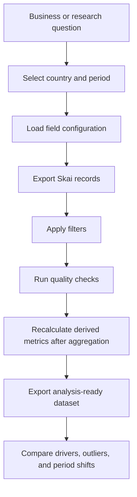

# Spirits Creative Performance AI

Data pipeline for AI-assisted creative-performance research in spirits advertising.


An AI-assisted data acquisition and performance reporting workflow built to collect, structure, and quality-check Skai advertising data for my Final Degree Project:

> **"Analysis of advertising creatives in spirits through AI"**

The project studied digital advertising creatives in the US spirits market, combining performance metrics with AI-generated visual variables to identify patterns associated with higher and lower CTR. This skill supported the data-engineering layer of that methodology: extracting Skai data by date range and country, organizing campaign/ad/creative metrics, preparing comparable datasets, and producing checks before the visual analysis stage.

## Why It Matters

My thesis required a dataset that was both analytically reliable and flexible enough to support creative-performance research. Raw platform data is not immediately suitable for that kind of analysis: fields differ by account, date ranges must be isolated, metrics need to be recalculated carefully, and suspicious or missing records must be surfaced before drawing conclusions.

This skill turns that messy platform-data step into a repeatable workflow.

| Research / business need | What the skill delivers |
| --- | --- |
| Build period-specific datasets for campaign analysis | Skai exports filtered by date range and country |
| Compare performance across commercial moments | Current/prior or multi-period export pattern |
| Adapt to account-specific schemas | Configurable dimensions and metrics |
| Avoid misleading performance conclusions | Quality checks for missing fields and suspicious records |
| Prepare data for creative analysis | Structured CSV/JSON outputs ready for downstream enrichment |

## Real Use Case: My TFG

The skill was used as part of a broader methodology to analyze the relationship between creative characteristics and advertising performance.


### Thesis Context

- **Topic:** AI-assisted analysis of digital advertising creatives.
- **Sector:** spirits advertising.
- **Market:** United States.
- **Performance metric:** CTR, calculated from clicks and impressions.
- **Commercial periods analyzed:** Super Bowl, Black Friday / Cyber Monday, and Christmas.
- **Methodological goal:** transform advertising creatives and platform metrics into structured data that could support exploratory visual-performance analysis.

The final thesis dataset combined performance information with visual variables extracted through AI. The broader methodology handled:

- performance extraction from structured campaign data,
- Skai API-based enrichment and organization,
- filtering by valid creative/image availability,
- grouping at creative level,
- recalculating impressions, clicks, and CTR,
- segmenting creatives into Top and Bottom groups,
- comparing patterns across commercial periods.

## What It Can Do

- Export Skai performance data by date range and country.
- Use configurable dimensions and metrics for account-specific schemas.
- Generate current and prior-period datasets for comparison.
- Filter video creatives or excluded brand groups when required.
- Identify top ads, campaigns, sources, brands, and outliers.
- Produce structured data quality checks for missing fields or suspicious records.
- Generate CSV/JSON outputs that can feed later creative, campaign, or business analysis.

## Analysis Flow



## Repository Structure

```text
.
|-- SKILL.md
|-- agents/openai.yaml
|-- references/
|   |-- analysis-playbook.md
|   |-- configuration.md
|   `-- default-field-config.json
`-- scripts/skai_report_export.py
```

## Example Commands

Single-period export:

```bash
python3 scripts/skai_report_export.py \
  --start-date 2026-04-01 \
  --end-date 2026-04-30 \
  --country US \
  --output-dir /tmp/skai-current
```

Comparison workflow:

```bash
python3 scripts/skai_report_export.py \
  --start-date 2026-04-01 \
  --end-date 2026-04-30 \
  --country US \
  --output-dir /tmp/skai-current

python3 scripts/skai_report_export.py \
  --start-date 2026-03-01 \
  --end-date 2026-03-31 \
  --country US \
  --output-dir /tmp/skai-prior
```

Optional filters:

```bash
python3 scripts/skai_report_export.py \
  --start-date 2026-04-01 \
  --end-date 2026-04-30 \
  --country US \
  --exclude-video \
  --exclude-brand \
  --output-dir /tmp/skai-filtered
```

## Output Files

| Output | Purpose |
| --- | --- |
| `skai_report_records.csv` | Main analysis table for spreadsheet or BI review |
| `skai_report_records.json` | Structured output for programmatic analysis |
| `summary.json` | Run metadata, filters, row counts, and coverage checks |

## Question Types Supported

| Question | Example output |
| --- | --- |
| Which campaigns explain a CTR shift? | Campaign-level contribution and deltas |
| Which ads are outliers? | High-impression low-CTR, high-cost, or missing-field records |
| How did performance change vs a prior period? | Absolute and relative deltas with caveats |
| Is the export analytically usable? | Coverage summary and missing-field checks |
| Which brands or sources are driving volume? | Ranked breakdowns by selected dimensions |

## Design Principles

- Treat platform exports as raw material, not as final analysis.
- Recalculate derived metrics after aggregation.
- Never average row-level CTR as a shortcut.
- Flag small samples before drawing conclusions.
- Keep field mappings configurable to handle account-specific schemas.
- Document filters and output coverage in `summary.json`.
- Make the workflow reproducible enough to support academic methodology and business use.

## Skills Demonstrated

`paid media analytics` - `Skai API` - `performance diagnostics` - `Python data exports` - `research data preparation` - `metric governance` - `data quality checks` - `creative analytics`

## Security

This is a sanitized showcase repository. It contains no Skai credentials, account IDs, profile IDs, private exports, proprietary campaign data, or thesis datasets.
